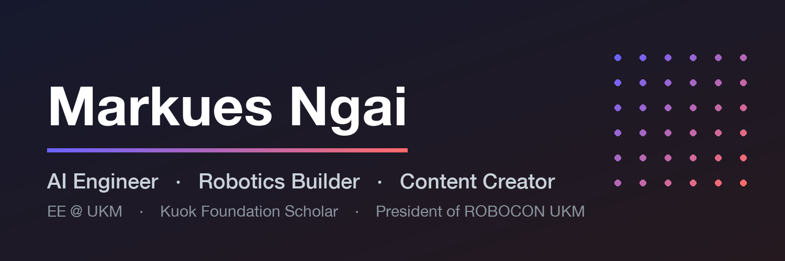

# Markues Ngai

**Electrical & Electronic Engineering (Year 2)** · The National University of Malaysia (UKM)
Kuala Lumpur, Malaysia

AI engineer and builder working across machine learning, embedded systems, and robotics. President of ROBOCON UKM, AI content creator, and multiple-time hackathon finalist.

---

## About

- 🎓 Kuok Foundation Scholar · Axiata ULDP Scholar
- 🤖 President of ROBOCON UKM · AI Lead at Gamuda AI Academy
- 🧠 Focused on AI, LLMs, and edge computing
- 📱 AI content creator — 20K+ followers, 7M+ cumulative views
- 🌏 Based in Kuala Lumpur, Malaysia

---

## Achievements

| Result | Event |
|--------|-------|
| 1st Runner-Up | Sime Darby Hackathon |
| 1st Runner-Up | Vhack 2025 |
| 2nd Runner-Up | UM Hackathon 2025 |
| 2nd Runner-Up | Google Cloud Hackathon Malaysia |
| Top 8 Projects | Embedded LLM |

## Leadership & Scholarships

- **Kuok Foundation** — Scholarship Holder
- **Gamuda AI Academy** — AI Lead
- **Axiata ULDP** — Scholar
- **ROBOCON UKM** — President

---

## Selected Work

| Project | Description | Stack |
|---------|-------------|-------|
| [**NI ARC 2026**](https://github.com/ngai123/2026) | Autonomous hoops robot simulator | Webots · MuJoCo · Python |
| [**AI Trading Arena**](https://github.com/ngai123/2026) | Multi-agent LLM paper-trading platform | FastAPI · Next.js · LLMs |
| [**FPGA Gesture Game**](https://github.com/ngai123/2026) | Accelerometer game on Nexys A7-100T | VHDL · VGA · SPI |
| [**Vhack 2025**](https://github.com/ngai123/2025) | Bitcoin trading ML platform (HMM + CNN + Ensemble) | Python · TensorFlow |
| [**UMACT 2025**](https://github.com/ngai123/2025) | Complaint auto-tagging system | BERT · scikit-learn |

Projects are organized into two repositories:
[**`2025`**](https://github.com/ngai123/2025) (competitions & hackathons) and
[**`2026`**](https://github.com/ngai123/2026) (current projects & open-source work).

---

## Technical Skills

- **Languages** — Python, C/C++, JavaScript/TypeScript, Dart, VHDL
- **AI / ML** — TensorFlow, PyTorch, scikit-learn, Keras, OpenCV, Hugging Face
- **Hardware** — Arduino, ESP32, Raspberry Pi, FPGA (Vivado)
- **Web** — FastAPI, Flask, Next.js, Flutter, React
- **Tools** — Git, Docker, Linux, Google Cloud

---

## GitHub Activity

